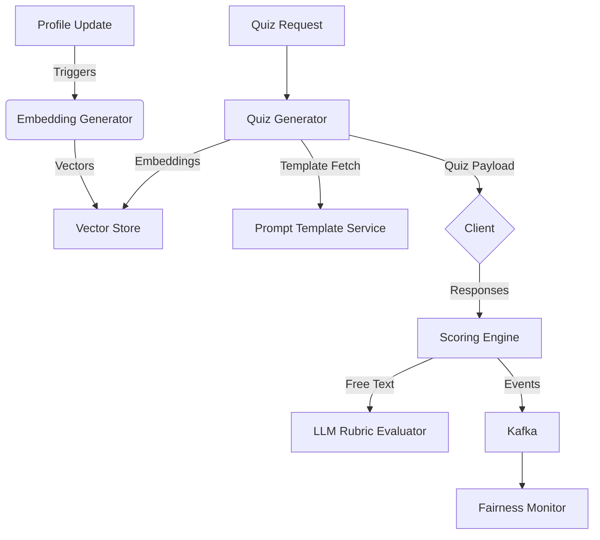

# Connection Key ML Services Blueprint

## Objectives
- Generate dynamic, context-aware quiz questions that reflect receiver preferences.
- Score responses for comprehension, consent alignment, and respectful tone with minimal latency.
- Monitor model fairness, safety, and drift while enabling rapid iteration.

## Service Layout
1. **Prompt Template Service (Python FastAPI)**
   - Stores reusable prompt fragments in PostgreSQL with localization metadata.
   - Exposes `/templates/{locale}` endpoint for Quiz Generator.
   - Supports feature flags to experiment with new question formats.

2. **Embedding Generator (Python, Hugging Face Transformers)**
   - Uses Sentence Transformers fine-tuned on annotated profile + quiz corpora.
   - Outputs 768-d vectors persisted in pgvector tables and cached in Redis.
   - Batch refresh job runs hourly; incremental updates triggered by profile edits.

3. **LLM Rubric Evaluator (FastAPI + vLLM)**
   - Hosts distilled 7B instruction-tuned model with guardrail prompts.
   - Evaluates free-response answers for empathy, consent acknowledgement, and toxicity risk.
   - Returns rubric scores (0–1) plus rationale snippets for audit surfaces.

4. **Fairness Monitor (Python, Dagster)**
   - Consumes Kafka `connection_key_events` topic to compute demographic metrics.
   - Emits alerts when pass rate delta >5% between protected cohorts.
   - Generates weekly fairness reports stored in S3 and surfaced in internal dashboard.

## Data Flow

## Model Governance
- **Versioning**: MLflow manages model versions; deployment tags map to feature flags.
- **Evaluation**: Pre-deploy evaluation suite checks accuracy, bias, latency, prompt injections.
- **Rollback**: Canary release via blue/green deployment; automatic rollback on SLO breach.
- **Red Teaming**: Quarterly adversarial prompts to test jailbreaks and consent edge cases.

## Observability
- Structured logs with prompt/response hashes to respect privacy.
- Traces include `quiz_id`, `model_version`, and `latency_ms` attributes.
- Metrics exported to Prometheus: generation latency, rubric score distribution, fairness alert counts.

## Responsible AI Practices
- Bias bounties encourage community feedback on unfair quiz outcomes.
- Consent-sensitive questions validated with domain expert review.
- Provide receivers a "Flag Quiz" option that routes payloads to human moderation with anonymized transcripts.

